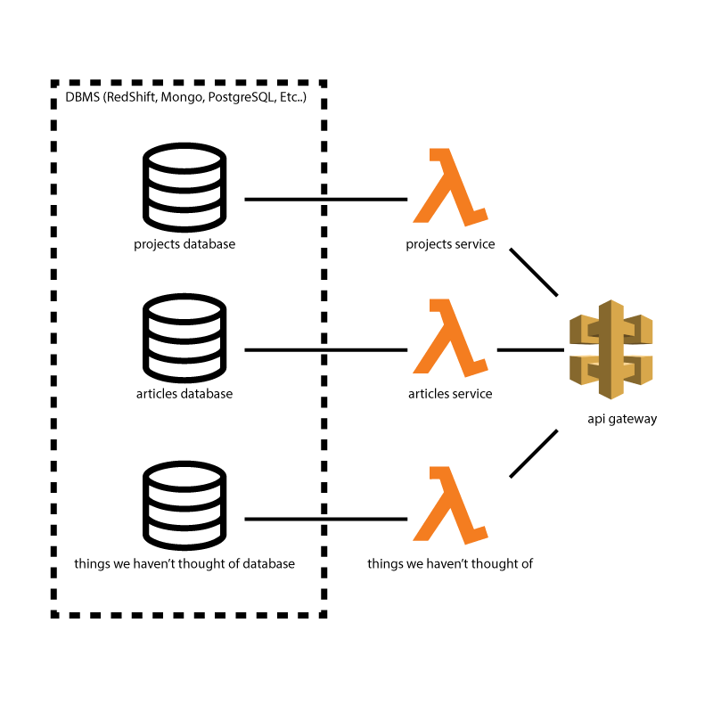

# rcos-open-source-curriculum-project

This repository aggregates documentation, specifications, and links to other repositories for the purpose of evaluation for developers participating in RCOS as a graded class.

This repository is part of the [RCOS Open Source Curriculum Project](https://github.com/codingandcommunity/rcos-open-source-curriculum-project). View that repository for additional documentation for the entire system.

## Contributing to this Repository
Adding documentation is awesome! Please do it. However, if you do, please use the pull request system so that we can review your changes.

## Curriculum Specifications

The unifying element of this project is curriculum specifications. Curriculum specifications
are a series of configuration files, instruction sets, and code that are interpreble
by the Atom plugin, allowing for students to experience project-based learning in a
guided environment. A detailed description of curriculum specifications can be found
[here](curriculum_spec.md).

## Repositories

This project is split into several main parts, including a web frontend, an Atom plugin, backend microservices, curriculum repositories and various other small helpers. Here is a comprehensive list of code repositories:

| Repository      | Description                                                                                  | Link                                                                 |
| ----------------|--------------------------------------------------------------------------------------------- | -------------------------------------------------------------------- |
| Spaceport          | React Frontend for the Booster API. Allows users to view projects online.                    | https://github.com/codingandcommunity/spaceport                      |
| Booster            | This is the backend API that hosts meta data for all projects that students can complete.    | https://github.com/codingandcommunity/booster-read-projects-function |
| Warp Drive         | Atom plugin for delivering and managing project and curriculum data for the students         | https://github.com/codingandcommunity/fast-forward                   |
| Omniscience        | This Mocha/Chai test script verifies that coding&&community web properties are online        | https://github.com/codingandcommunity/omniscience                    |
| Curriculum Utility | A simple Python script to help parse git logs of a project into curriculum stages.           | https://github.com/codingandcommunity/curriculum_utility             |

And the following is a list of repositories containing curriculum information:

| Repository      | Description                                                                                  | Link                                                                 |
| ----------------|--------------------------------------------------------------------------------------------- | -------------------------------------------------------------------- |
| Example Project   | This is an example project that students studing this curriculum may use. Specialize format. | https://github.com/codingandcommunity/booster-project-hello-world     |
| Sample Curriculum | This is an example project where a student implements a chess game using React. Built for testing purposes. | https://github.com/codingandcommunity/sample-curriculum   |
| Sample App        | The actual projec that the above sample curriculum references. Modules of sample curriculum link to this repository. | https://github.com/codingandcommunity/sample-app        |
| React Curriculum  | Teaching introductory programming in a React environment.          | https://github.com/codingandcommunity/RCOSReactcurriculum              |

## Spaceport/Booster Architecture Diagram

Part of the open source curriculum project is a website that serves rich content and metadata about the projects students can complete. This website is implemented as a ReactJS frontend that pulls data from a JSON api that runs on AWS Lambda.

## Booster Architecture Diagram
The Booster API should follow microservice design principles. Services are split into _features_ where features are defined to be sets of responsibilities that one or more people are responsible for. This should allow for healthy long-term growth and maintenance of this project through high developer turnover.

## Development AWS URLs

- Backend API (Raw Lambda): https://qdljuxtz6h.execute-api.us-east-1.amazonaws.com/prod/projects
- Backend API (Cached on CloudFront): https://d3852d07prc7x3.cloudfront.net
- Frontend Website: https://d2rnbxax6frc7g.cloudfront.net/

### Past Contributors ###

Add your name here if you're committing changes to this repository.

- [Jake Billings](https://jakebillings.com)
- [Mitchell Falkow](https://github.com/mdfalkow)
- [Ethan Graf](https://ethangraf.com)
