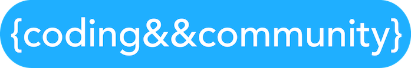

# rcos-open-source-curriculum-project

This repository aggregates documentation, specifications, and links to other repositories for the purpose of evaluation for developers participating in RCOS as a graded class.

This repository is part of the [RCOS Open Source Curriculum Project](https://github.com/codingandcommunity/rcos-open-source-curriculum-project). View that repository for additional documentation for the entire system.

## Microservice Architecture

This project uses a serverless microservice architecture. It has many components across many GitHub repositories. Here is a list:

| Repository      | Description                                                                                  | Link                                                                 |
| ----------------|--------------------------------------------------------------------------------------------- | -------------------------------------------------------------------- |
| Spaceport       | React Frontend for the Booster API. Allows users to view projects online.                    | https://github.com/codingandcommunity/spaceport                      |
| Booster         | This is the backend API that hosts meta data for all projects that students can complete.    | https://github.com/codingandcommunity/booster-read-projects-function |
| Example Project | This is an example project that students studing this curriculum may use. Specialize format. | https://github.com/codingandcommunity/booster-project-hello-world    |

This list is currently incomplete. It is missing the ATOM plugin and possibly other repositories.

## Spaceport/Booster Architecture Diagram

Part of the open source curriculum project is a website that serves rich content and metadata about the projects students can complete. This website is implemented as a ReactJS frontend that pulls data from a JSON api that runs on AWS Lambda.

## Development AWS URLs

- Backend API: https://qdljuxtz6h.execute-api.us-east-1.amazonaws.com/prod/projects
- Frontend Website: https://d2rnbxax6frc7g.cloudfront.net/

### Past Contributors ###

Add your name here if you're committing changes to this repository.

- [Jake Billings](https://jakebillings.com)