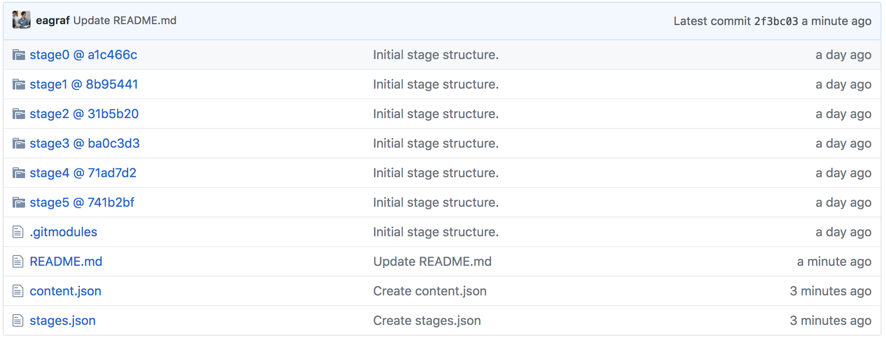

# Curriculum Specifications

Curriculum specifications are the invariant of the Open Source Curriculum Project (i.e. anyone working on the OSCP
will eventually work with curriculum specifications). Curriculum specifications define all of the information encapsulated
by a specific project curriculum, including concept overviews, tasks and instructions, test cases and more. Following
below is the most recent update of how curriculums are defined:

## Version 0.01

This is the initial, extremely rough, work in progress specification for curriculums. A distinction should be made between two main types of curriculums: project based and article based. Project based curriculums are based around a series of tasks that contribute to an overarching project. All concepts are learned as students complete tasks along the way. Article based curriculums present all their concepts in text in order (think textbooks, slides, notes). The eventual goal of this project is to build a specification that accounts for both of these types of curriculums, but initially the focus will be on project based ones.

For project curriculums, the goal is to create a "guided project", that provide just the right ammount of starter code and boilerplate to get a student engaged in the most intellectually stimulating pieces of a certain topic, avoiding the most tedious and unnescessary portions. These projects are separated into different stages, with each successive stage introducing addition starter code and boiler plate once a student has completed the tasks for the previous stage.

### Project Repositories

An example guided project curriculum repository can be found [here](https://github.com/codingandcommunity/sample-curriculum). 
When you take a look at it on GitHub, it may look a bit like this

Note that the various stages of the project are represented by [Git submodules](https://git-scm.com/book/en/v2/Git-Tools-Submodules). Each module links to a particular branch in the project repository, corresponding to that stage. Note that 
the actual [project repository](https://github.com/codingandcommunity/sample-app/) that the curriculum is based off of is external to the curriculum repository.
### Project Task Specifications

### Concept Specifications
